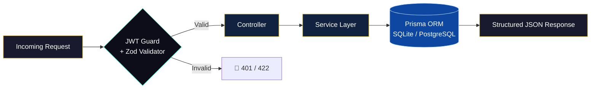

<div align="center">


<br/>

<p align="center">
  
</p>

<br/>

[](#)
[](#)
[](#)
[](#)
[](#)
[](#)
[](#)
[](#)

</div>

---

## 🧠 About This Engine

> **EVA-SASMS Backend** is the armored nervous system behind the entire SASMS ecosystem. It's not just an API — it's a **stateless, role-aware, schema-dynamic intelligence core** built to power every academic operation at scale.

This backend doesn't just serve data. It **orchestrates the entire academic lifecycle** — from the moment an applicant submits their first form, through real-time score parsing, bulk admission processing, interview scheduling, financial wallet management, all the way to live student dashboards. Every operation is guarded, validated, and logged.

Built on a philosophy of **Zero Trust** and **Maximum Throughput**, this engine is what makes SASMS feel like a Fortune 500 platform rather than a school management tool.

---

## ⚡ Core Capabilities

### 🛡️ Authentication & Authorization Layer
- **Stateless JWT Architecture** — No session storage, no bottlenecks, pure token-based identity
- **Granular RBAC** — Three sovereign roles (`SuperAdmin`, `Staff`, `Student`) with completely isolated permission matrices
- **Auto-Morph Logic** — When an applicant is approved, the system automatically promotes their identity to a full `Student` profile
- **Route-Level Guards** — Every single endpoint enforces token validation before a single byte of processing begins

### 🧬 Dynamic Schema Intelligence
- **Runtime Field Injection** — SuperAdmins can add custom fields (Text, Dropdown, File Upload) to admission forms directly via the UI; Prisma propagates schema changes instantly
- **Self-Healing Validation** — Zod inspects every incoming payload, strips unknown keys, and rejects non-conforming requests at the gate
- **Document Isolation** — Custom uploaded files are served in sandboxed containers, preventing any XSS vector in admin review flows

### 📊 Admission Pipeline Engine
- **Multi-Source Score Parser** — Merges and normalizes Ministry scores, entrance exam results, and interview ratings into a unified applicant ranking
- **Algorithmic Leaderboard API** — Exposes filterable, sortable applicant rankings without ever touching the database twice
- **Bulk Execution Engine** — Approve 1,000+ applicants or schedule 500+ interviews in a single atomic transaction — no CPU stress, no race conditions

### 💰 Financial & Communication Core
- **Smart Wallet API** — Live tuition balance tracking, itemized payment history, and gateway-ready payment endpoints per student
- **Ticketing System** — Full complaint and support ticket lifecycle management with admin assignment and real-time status tracking

---

## 🏗️ Architecture Overview

```
EVA-SASMS-backend/
│
├── 📁 src/
│   ├── 📁 routes/          # Express route declarations (modular per domain)
│   ├── 📁 controllers/     # Business logic execution layer
│   ├── 📁 middleware/       # JWT guard, role enforcer, Zod validators
│   ├── 📁 services/         # Domain services (admission, finance, scheduler)
│   └── 📁 utils/            # Helpers, formatters, response builders
│
├── 📁 prisma/
│   ├── schema.prisma        # Master data schema (SQLite dev / PostgreSQL prod)
│   └── seed.ts              # Bootstrapper: default SuperAdmin + test data
│
├── .env                     # Environment secrets vault
├── package.json
└── tsconfig.json
```

### Data Flow



---

## 🚀 Ignition Sequence

### Prerequisites

| Tool | Min Version |
|------|-------------|
| Node.js | `v18+` |
| npm | `v9+` |

### 🔥 Full Cold Start

```bash
# Step 1 — Navigate into the engine
cd EVA-SASMS-backend

# Step 2 — Install all architectural dependencies
npm install

# Step 3 — Run initial migration & generate Prisma client types
npx prisma migrate dev --name init
npx prisma generate

# Step 4 — Deploy migrations to the target database
npx prisma migrate deploy

# Step 5 — Sync schema state (safe for repeating)
npx prisma db push

# Step 6 — Seed the database (SuperAdmin + default data)
npm run seed

# Step 7 — Launch the enterprise engine 🚀
npm run dev
```

> Engine fires up on **`http://localhost:5001`**

---

## 🔐 Environment Variables

Create a `.env` file in the root of `EVA-SASMS-backend/`:

```env
# Database connection (SQLite for dev, PostgreSQL for prod)
DATABASE_URL="file:./dev.db"

# JWT signing secret — change this in production
JWT_SECRET="your-ultra-secret-key-here"

# Server port
PORT=5001

# File upload destination
UPLOAD_DIR="./uploads"
```

---

## 🌐 API Surface (Domain Map)

| Domain | Base Route | Auth Required |
|--------|-----------|---------------|
| Authentication | `/api/auth` | ❌ Public |
| Applicant Portal | `/api/applicant` | ✅ Applicant Token |
| Student Dashboard | `/api/student` | ✅ Student Token |
| Staff Operations | `/api/staff` | ✅ Staff Token |
| SuperAdmin Control | `/api/admin` | ✅ SuperAdmin Token |
| Dynamic Fields | `/api/admin/fields` | ✅ SuperAdmin Token |
| Financial Wallet | `/api/finance` | ✅ Student/Admin Token |
| Tickets & Support | `/api/tickets` | ✅ Any Authenticated |

---

## 🔑 Default Master Credentials

After running `npm run seed`, the SuperAdmin account is initialized:

```
Email   : admin.super@sasms.edu
Password: 123456
Role    : SUPER_ADMIN
```

> ⚠️ **Change these immediately in any production deployment.**

---

## 🛡️ Security Architecture

```
┌─────────────────────────────────────────────────────┐
│                   SECURITY LAYERS                    │
├─────────────────────────────────────────────────────┤
│  Layer 1 │ HTTPS Transport Enforcement              │
│  Layer 2 │ JWT Signature Verification (RS256/HS256) │
│  Layer 3 │ Role Scope Enforcement (RBAC)            │
│  Layer 4 │ Zod Payload Schema Validation            │
│  Layer 5 │ File Sandboxing (XSS Prevention)         │
│  Layer 6 │ Prisma Parameterized Queries (SQLi Guard)│
└─────────────────────────────────────────────────────┘
```

---

## 🧪 Development Commands

```bash
npm run dev          # Start dev server with hot-reload (ts-node-dev)
npm run build        # Compile TypeScript to /dist
npm run start        # Run compiled production build
npm run seed         # Re-seed database with default data
npx prisma studio    # Open visual database GUI at localhost:5555
```

---

<div align="center">

**EVA-SASMS Backend** — *The engine never stalls. The fortress never falls.*


</div>
